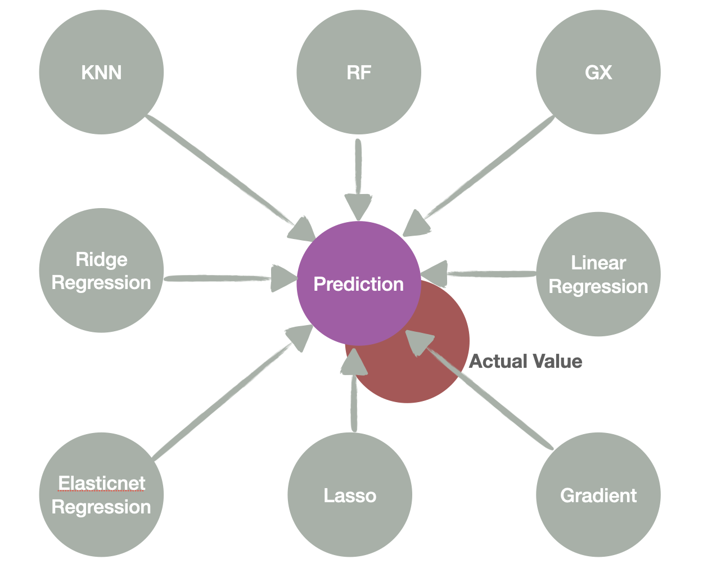

Ames Iowa Housing Price Prediction
===========================

#### Authors : [Dan Ortiz](https://github.com/cal-dortiz/) | [Dan Weitz](https://github.com/djweitz) 

U.C. Berkeley, Masters in Information & Data Science program - [datascience@berkeley](https://datascience.berkeley.edu/) 

Spring 2021, W207 - Machine Learning - D. Schioberg, PhD  
Section #3 - Tuesday, 4:00pm PDT

----

Photo by [David McBee](https://www.pexels.com/@davidmcbee?utm_content=attributionCopyText&utm_medium=referral&utm_source=pexels) from [Pexels](https://www.pexels.com)

## Description

## About
This GitHub repo contains files pertaining to Daniel Ortiz and Daniel Weitz's predictive model for housing prices based on the [Ames Housing dataset](http://jse.amstat.org/v19n3/decock.pdf) compiled by compiled by Dean De Cock. Data was sourced from [Kaggle](https://www.kaggle.com/).

## Goal
Develop a model or set of models that utilize machine learning techniques to either individually or collectively predict the housing prices for each home in the test dataset as accurately as possible. 

## Key Performance Indicator
Model performance will be evaluated based upon the Root Mean Square Error (RMSE) between the logarithm of the predicted value and the logarithm of the observed sales price. For the purposes of this exercise, a lower RMSE will be deemed to represent superior performance compared to a higher RMSE.

## Data Cleaning Process
After loading the data, we determined that the training data consisted of 80 attributes, including the sale price, while the testing data comprised 79 attributes (all but the sales price). Because our objective was to predict the sales price, we could not use the test data to confirm/refute our predictions - and as a result we use the training data to conduct all of our analysis, and separate the data into training/testing subcomponents as appropriate.

To clean the data, we first removed categories that did not exhibit a meaningful relationship to sales price (i.e. index number, miscellaneous features, pool quality, presence of an alley, presence of a fence, and total basement square footage). We additionally removed several outliers from the data per the recommendation of the data set documentation (houses in excess of 4000 square feet of greater living area were omitted). Removing the outliers alone accounted for a ~25% decrease in our overall RMSE. We also created a new feature for total square footage that combined existing features (square footage for the first and second floor of the house) in order to capture their potential explanatory power with respect to sales price while removing potential multicollinearity among the variables.

We next transformed all of our non-numerical data into numerical form to ensure it could be used as inputs into our machine learning algorithm. For data where the categorical data was ordinal in nature, we replaced the categories with numerical values in a consistent manner. For categories that were purely text-based (without ordinal qualities), we employed label encoding to convert the data into a machine readable state. In certain cases, missing nominal data, was set to 0. This decision was made in the interest of time and based on the author's judgment that it represented a reasonably accurate representation of the missing data, though this presents an opportunity for future improvement. 

We also transformed our variable of interest, SalePrice, into logarithmic form, which resulted in a more normally distributed variable.

Finally, we selected the 9 attributes that exhibited the strongest correlations with sales price as inputs into our regression models, and all the remaining attributes into our classification models.

## Model Construction

Once cleaned, nine independent machine learning models were created. Additionally, we created a tenth ensemble model that was a composite of eight out of the nine independent models (excluding AdaBoost Regression, which performed notably poorly). The ensemble method was utilized to offset the prospect of overfitting from within any single model. Each model varies in its prediction, and the ensemble model takes the mean of the independent models' outputs, and uses this as a final prediction output. The results demonstrate a significant improvement of the ensemble models' performance over those of the independent models. We believe this is due to the fact that predictions from each independent model generally varied around the actual house price, and taking an average yielded a closer prediction in relation to the actual house price than any single model could deliver.

  

## Model Performance (Nine Independent Models) (Ordered Worst to Best)

|Model|Performance (RMSE)|
|-----|------------------|
|AdaBoost Regressor|0.13895630868758335|
|KNN|0.09330931188271539|
|Lasso Model|0.033628673718841345|
|Gradient Boost|0.029133110725273772|
|XG Boost|0.027226188758273515|
|Elasticnet Regression|0.024920651907556823| 
|OLS Multiple Regression|0.024787912522198273|
|Ridge Regression|0.02474298302292999|
|Random Forrest|0.021088824795945284|

## Model Performance (Final Ensemble Model)

The ensemble model performed best, with a root-mean-squared-error of **0.01941**. This puts the model's expected performance within the top 200 submissions out of 7894 total submissions.

Kaggle Leaderboard 4/10/21

## Files

The following files are included in our GitHub repository: 

|Name|Description|
|----|-----------|
|[Data Doc](https://github.com/cal-dortiz/W207_Applied-_Machine_Learning/blob/183fae86e5c0acd1937557404734a1df7b4172d4/Final_Project/Data/data_description.txt)|Documentation regarding the data set|
|[Train Data](https://github.com/cal-dortiz/W207_Applied-_Machine_Learning/blob/183fae86e5c0acd1937557404734a1df7b4172d4/Final_Project/Data/train.csv) |Data used to train the model|
|[Test Data](https://github.com/cal-dortiz/W207_Applied-_Machine_Learning/blob/183fae86e5c0acd1937557404734a1df7b4172d4/Final_Project/Data/test.csv)|Data used to test the model|
|[Initial EDA](https://github.com/cal-dortiz/W207_Applied-_Machine_Learning/blob/main/Final_Project/Data%20Exploration%20Files/Exploratory%20Data%20Analysis.ipynb) | Initial Exploratory Data Analysis|
|[Data Cleaning and Feature Engineering](https://github.com/cal-dortiz/W207_Applied-_Machine_Learning/blob/main/Final_Project/Data%20Exploration%20Files/Data%20Cleaning%20and%20Feature%20Engineering.ipynb)|Code to clean data and transform features in preparation for model analysis|
|[Regression Models](https://github.com/cal-dortiz/W207_Applied-_Machine_Learning/blob/main/Final_Project/Model%20Files/Final%20Model.ipynb)|Notebook that explores 10 different regression models and corresponding RMSEs|

## Findings
* The KNN model performed most poorly, which is likely a result of the high dimensionality of the data once the categorical variables had been encoded. On the other hand, the random forest model performed remarkably well, which may relate to its adeptness at dealing well with large numbers of features. 
* Three of the "linear regression" models - Elasticnet, Ridge, and OLS multiple regression - all performed very similarly. 
* The strongest performance, however, was the ensemble method, and this was particularly the case when the Adaboost regression was omitted from its calculation. 

## Required Technologies
* Python 3.7
* Pandas
* Numpy
* XGBoost
* SkLearn
* MatPlotLib

## Future Work
1. Hypertuning each model
    *  There are opportunities to hypertune each model for better performance. Hypertuning each model will lead to a higher performing ensemble model. This includes normalizing and scaling data to exploring different combinations of attributes.
2. Further transformation study
    *  There are opportunities to investigate additional data transformations that may improve model performance. In addition, there are opportunities to explore the development of new attributes based of off existing attributes.
3. Data Processing - Nominal Data
    * We believe there are opportunities to develop ways to handle missing nominal data in a more granular/carefully-tailored manner that could boost model performance. This is an area we highly recommend exploring in future work.
4. Neighborhood Assessment
    * Ames is a college town and such, certain neighborhoods may have housing that is geared towards the college student demographic. This insight may lead to further model development that captures uniqueness variation in neighborhoods and its relationship with sale prices. We believe this is a fruitful area for further study. 

## Credits
* Data Source: [Kaggle](https://www.kaggle.com/c/house-prices-advanced-regression-techniques)
* README template: [Cristopher Benge](https://cbenge509.github.io/) | [William Casey King, PhD](https://jackson.yale.edu/person/casey-king/) 
License
-------

Licensed under the MIT License. See [LICENSE](LICENSE.txt) file for more details.
