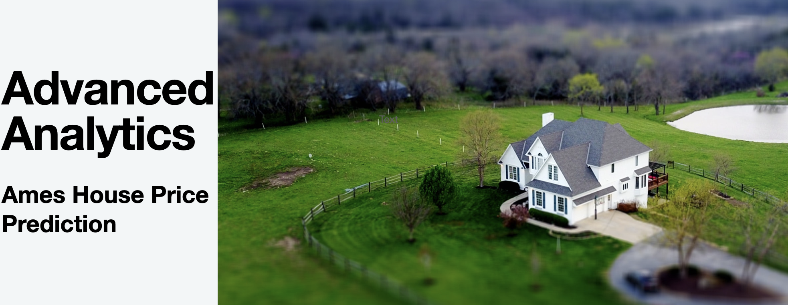
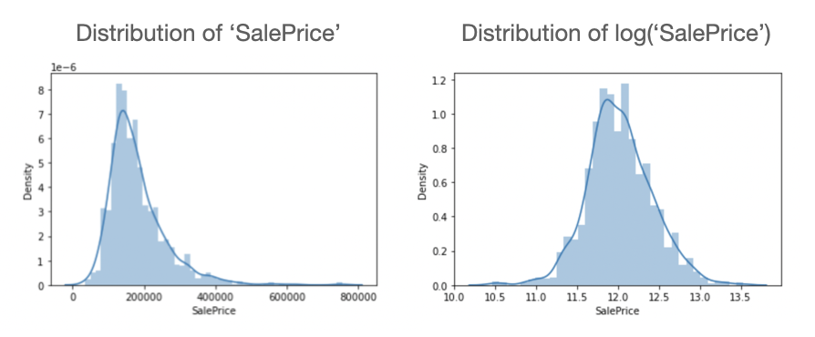
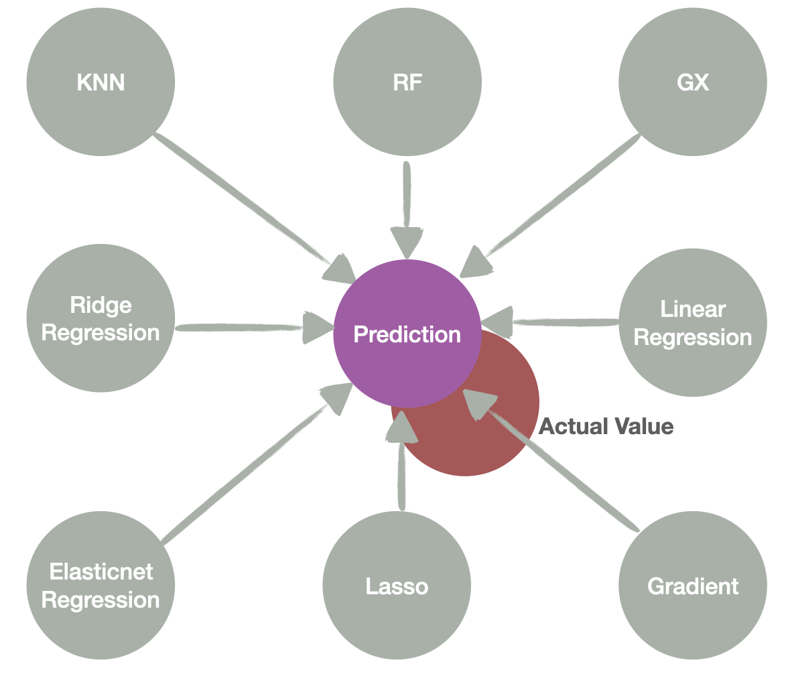
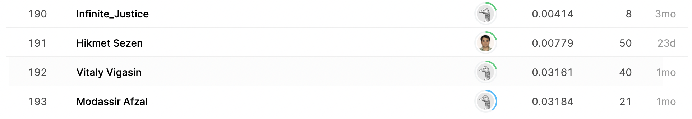

Project 4 - House Prices - Advanced Regression Techniques
===========================

#### Authors : [Daniel Ortiz](https://github.com/cal-dortiz/) | [Daniel Weitz](https://github.com/djweitz) 

U.C. Berkeley, Master of Information & Data Science Program - [datascience@berkeley](https://datascience.berkeley.edu/) 

Spring 2021, W207 - Introduction to Machine Learning - Doris Schioberg, PhD  
Section #3 - Tuesday, 4:00pm PDT

----

Photo by [David McBee](https://www.pexels.com/@davidmcbee?utm_content=attributionCopyText&utm_medium=referral&utm_source=pexels) from [Pexels](https://www.pexels.com)

## Description

## About
This GitHub repo contains files pertaining to Daniel Ortiz and Daniel Weitz's predictive models for house prices in Ames, Iowa based on the [Ames Housing dataset](http://jse.amstat.org/v19n3/decock.pdf) compiled by Dean De Cock. Data was sourced from [Kaggle](https://www.kaggle.com/).

## Goal
Develop a model or set of models that utilize machine learning techniques to predict the housing prices for each home in the test dataset as accurately as possible. 

## Key Performance Indicator
Model performance will be evaluated based upon the Root Mean Square Error (RMSE) between the logarithm of the predicted value and the logarithm of the observed sales price. For the purposes of this exercise, a lower RMSE will be deemed to represent superior performance compared to a higher RMSE.

## Data Cleaning Process
After loading the data, we determined that the training data consisted of 80 attributes, including the sale price, while the testing data comprised 79 attributes (all but the sales price). Because our objective was to predict the sales price, we could not use the test data to confirm/refute our predictions. As a result, we use the training data to conduct all of our analysis, and separate the data into training/testing subcomponents as appropriate to train and evaluate models.

To clean the data set, we first removed categories that did not exhibit a meaningful relationship with the sales price (These included index number, miscellaneous features, pool quality, presence of an alley, presence of a fence, and total basement square footage). We additionally removed several outliers from the data as recommended by the data set documentation (houses whose greater living area was in excess of 4000 square feet were omitted). Removing the outliers alone resulted in a ~25% decrease in our models' overall RMSE. We also created (engineered) a new feature for total square footage that combined existing features (square footage for the first and second floors of the house) in order to capture their potential explanatory power with respect to sales price while avoiding potential multicollinearity among the variables.

We next transformed all of our non-numerical data into numerical form to ensure they could be used as inputs into our machine learning algorithm. For attributes whose categorical data was ordinal in nature, we replaced the categories with numerical values in a consistent manner. For categories that were purely categorical (i.e. not ordinal), we employed label encoding to convert the data into a machine-readable state. In certain cases, missing data values were set to 0. This decision was made in the interest of time and based on the authors' judgment that these values represented a reasonably accurate representation of the missing data. That said, this may represent an opportunity for future students to adopt more nuanced approaches. 

We also transformed our variable of interest, SalePrice, into logarithmic form, which resulted in the data values becoming more normally distributed.

Finally, we selected the 9 attributes that exhibited the strongest correlations with sales price as inputs into our regression models, and all attributes were used as inputs into our classification models.

## Model Construction

Once the data had been cleaned and all features transformed, nine independent machine learning models were created. Additionally, a tenth ensemble model was created that was a composite of eight out of the nine independent models (excluding AdaBoost Regression, which performed notably poorly). The ensemble method was utilized to offset the prospect of overfitting from biasing any single model. Since each model varies in its predicted sale price, the ensemble model takes the mean of the independent models' outputs, and uses this calculation as a final prediction output. The results demonstrate a significant improvement in performance (i.e. lower RMSE) compared to the independent models. We believe this is due to the fact that predictions from each independent model generally vary around the actual sale price, and taking an average yielded a closer prediction in relation to the actual house prices than any single model could consistently deliver.

  

## Model Performance (Nine Independent Models) (Ordered Worst to Best)

|Model|Performance (RMSE)|
|-----|------------------|
|KNN|0.09358343836948645|
|AdaBoost|0.0793968347837942|
|Lasso Model|0.035909927409052286|
|Gradient Boost|0.032302513360016355|
|XG Boost|0.028530388967825882|
|Random Forest|0.027816026500681688|
|OLS Multiple Regression|0.02655829231118724|
|Elasticnet Regression|0.02650422952476914| 
|Ridge Regression|0.026489458629790748|

## Model Performance (Final Ensemble Model)

The ensemble model performed best of all models, with a root-mean-squared-error of **0.02166**. This puts the model's expected performance within the top 200 submissions to Kaggle out of 7894 total submissions.

Kaggle Leaderboard 4/10/21

## Files

The following files are included in our GitHub repository: 

|Name|Description|
|----|-----------|
|[Data Description](https://github.com/cal-dortiz/W207_Applied-_Machine_Learning/blob/183fae86e5c0acd1937557404734a1df7b4172d4/Final_Project/Data/data_description.txt)|Documentation regarding the data set|
|[Train Data](https://github.com/cal-dortiz/W207_Applied-_Machine_Learning/blob/183fae86e5c0acd1937557404734a1df7b4172d4/Final_Project/Data/train.csv) |Data used to train the model|
|[Test Data](https://github.com/cal-dortiz/W207_Applied-_Machine_Learning/blob/183fae86e5c0acd1937557404734a1df7b4172d4/Final_Project/Data/test.csv)|Data used to test the model|
|[Initial EDA](https://github.com/cal-dortiz/W207_Applied-_Machine_Learning/blob/main/Final_Project/Data%20Exploration%20Files/Initial%20Exploratory%20Data%20Analysis.ipynb) | Initial Exploratory Data Analysis|
|[Data Cleaning and Feature Engineering](https://github.com/cal-dortiz/W207_Applied-_Machine_Learning/blob/main/Final_Project/Data%20Exploration%20Files/Data%20Cleaning%20and%20Feature%20Engineering.ipynb)|Code to clean data and transform features in preparation for model analysis|
|[Final Models](https://github.com/cal-dortiz/W207_Applied-_Machine_Learning/blob/main/Final_Project/Model%20Files/Final%20Model.ipynb)|Notebook that explores 10 different models and corresponding RMSEs|

## Findings
* The KNN model performed worst, which is likely a result of the high dimensionality of the data once the categorical variables had been encoded. On the other hand, the random forest model performed reasonably well, which may relate to its adeptness at dealing with large numbers of features. 
* Three of the "linear regression" models - Elasticnet, Ridge, and OLS multiple regression - all performed very similarly. 
* The strongest performance, however, was the ensemble method, and this was particularly the case when the Adaboost regression was omitted from its calculation.

## Required Technologies
* Python 3.7
* Pandas
* Numpy
* XGBoost
* SciKitLearn
* MatPlotLib

## Future Work
1. Hypertuning each model
    *  There are opportunities to hypertune each model for better individual model performance and higher performance in the ensemble model. Such tuning may include normalizing and scaling data to explore different combinations of attributes.
2. Additional transformations and feature engineering
    *  Future students should consider additional transformations of existing data to improve model performance. In addition, future students should explore the development of new attributes by combining/modifying existing data.
3. Data Processing - Nominal Data
    * Future students should think more carefully/granularly about how best to handle missing data in order to most appropriately classify missing values.
4. Neighborhood Assessment
    * Ames is a college town and as such, certain neighborhoods may have housing that is geared towards the college student demographic. This insight may lead to further tailoring of models to capture unique variations in neighborhoods and their relationship with sales prices. We believe this is a fruitful area for further study. 

## Credits
* Data Source: [Kaggle](https://www.kaggle.com/c/house-prices-advanced-regression-techniques)
* README template: [Cristopher Benge](https://cbenge509.github.io/) | [William Casey King, PhD](https://jackson.yale.edu/person/casey-king/) 
License
-------

Licensed under the MIT License. See [LICENSE](LICENSE.txt) file for more details.
